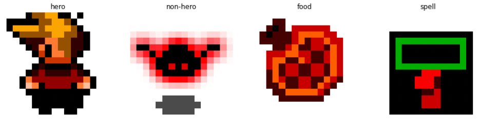

# Weights & Biases: Experiment Tracking 

We will add weights & biases python library (wandb) to sprite classification model training, so that we can track and 
visualize important metrics, gain insights into our model's behavior and make informed decisions for model improvements. 

We will also see how to compare and analyze different experiments, and reproduce results effectively.

## Setting Up

```Python
pip install wandb
pip install torch
pip install torchvision
```

## Sprite classification

We will build a deep learning model to classify sprites. 

You can see some examples of sprites and corresponding classes in the image below.



## Weights & Biases: Experiment Tracking

We have to initialize our Weights & Biases with the command:

```Python
from types import SimpleNamespace

config = SimpleNamespace(
    epochs=2,
    batch_size=128,
    lr=1e-5,
    dropout=0.5,
    slice_size=10_000,
    valid_pct=0.2
)

wandb.init(project=project_name, config=config)
```

The project_name is the name of your Weights & Biases project and the config object is needed for the following tasks.

Once we have the metrics about the training or the validation of our model, we will log them to our Weights & Biases 
project with the command:

```Python
metrics = { "train/train_loss": train_loss}

wandb.log(metrics)
```

After, we only have to connect anonymously or directly to our project with the command:

```Python
# Connect anonymously
wandb.login(anonymous="allow")

# Connect to our project
wandb.login(key=wandb_api_key)
```

Then, train our model and visualize the experiment tracking of our metrics on our Weights & Biases project server through 
visualizations.

What it's really cool with Weights & Biases, is that, we can run our model with different config values and have the 
possibility to visualize every experiment tracking as a run and even compared each other.

By clicking on the button at the right of the "Runs", we can click on the "Columns" button and add the "val/val_accuracy" 
in the hidden section to display it.

Then, if we want to filter the column "val/val_accuracy", we only have to click on the "Filter" button choose 
"val/val_accuracy" and write the minimum value to filter the runs.

It is even possible to sort the runs with "val/val_accuracy" by clicking on the sort button and writing val/val_accuracy. 
This could be really helpful when there is a lot of runs. 

## Weights & Biases: Versioning and Storing Files
To save the results of training, Weights & Biases add the "Artefact". 

The artefact will help us, for example, to save the model checkpoints at different iteration.

```Python
# create a wandb run
run = wandb.init(project=project_name, config=config)

# save model periodically
artifact_name = f"{wandb.run.id}_context_model"
at = wandb.Artifact(artifact_name, type="model")
at.add_file(ckpt_file)  # ckpt_file: model checkpoint file
wandb.log_artifact(at, aliases=[f"epoch_{ep}"])  # ep: the number of epoch
```

This is the way of versioning and storing files within runs.

Here, the "Artefact" is used for model checkpoints but we could also use it for a dataset, a prediction or even code.

Now, to make our model available for our team, we only have to open "Artefact" in Weights & Biases, 
select the latest model, link it into the model registry. 

After, the model is link into the model registry, we can see the model. 
The model registry give your team a central place to see all the best model versions.
